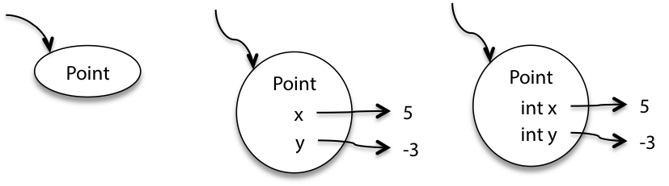
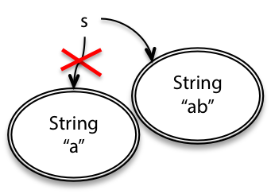
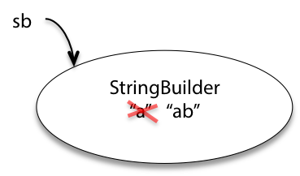
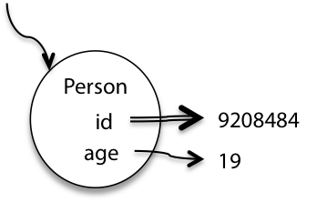
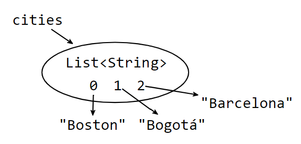
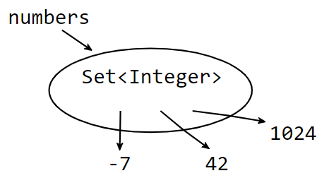
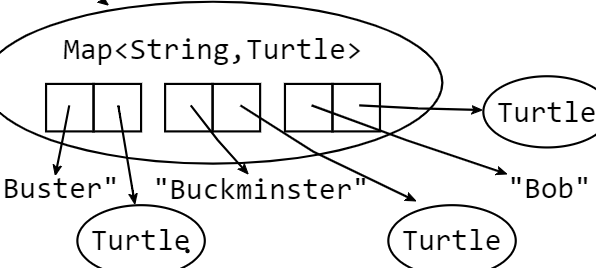

# Basic Java

## Snapshot Diagrams

We use snapshot diagrams top represent the internal state of a program at run time.

### Primitive Values

Primitive values are represented by constants, and the incoming arraw is a reference to this value.


### Object Values

An object value is a circle labeled by its type. When we want to show more detail, we write field names inside it, with arrows pointing out to their values. The fields can also include their declared types.



### Mutating values and Reassigning variables

**Reassignment and Immutable Values**
```java
String s = "a";
s = s + "b";
```


We can see the arrow changing; this reflect reassignment.

Immutable objects (intended by their designer to always represent the same value) are denoted in a snapshot diagram by a double border, like the `String` objects above.

**Mutable values**
```java
StringBuilder sb = new StringBuilder("a");
sb.append("b");
```


We see that `StringBuilder` is mutable and the instance variables are modified.

**References**

Immutable references (with `final`) are denoted by a double arrow (below pic shows `id` never changes but age can change)



> We can have *immutable reference* to a *mutable value* like `final StringBuilder sb`, where we can modify the contents of the reference object
>
> We can also have a *mutable reference* to a *immutable value* like `String s`, where we can point the reference to a diff object

## Java Collections

### Lists, Sets and Maps

**List**

Java `List` is very similar to a Python `List`.
- `int count = lst.size()` counts the number of elements
- `lst.add(e)` appends an element to the end of the list
- `if (lst.isEmpty())` test if list is empty



This list `cities` may contain some strings

**Set**

A `Set` is an unordered collection of zero or more unique objects.

- `s1.contains(e)` test if set contains an element
- `s1.containsAll(s2)` test whether `s2` is a subset of `s1`
- `s1.removeAll(s2)` remove subset `s2` from `s1`



`numbers` contains integers in no particular order

**Map**

A `Map` is very similar to a Python dictionary. The keys must be hashable!

- `map.put(key,val)` adding the mapping `key->val`
- `map.get(key)` get the value for a key
- `map.containsKey(key)` check if the map contains a key
- `map.remove(key)` delete a key (hence the mapping)



This `turtles` map contains keys of `String` and mapping to `Turtle` objects

### Literals

Java does have a literal syntax for arrays (not lists) `String[] arr = {"a","b","c"}` and use a utility function to create a list `Arrays.asList(new String[] { "a", "b", "c" })`. However, a list created with `Arrays.asList` does have a fixed length.

### Generics: declaring List, Set and Map variables

Unlike Python, with Java collections we can restrict the type of objects contained in the collection. When we add an item, the compiler can perform static checking to check if added items are of the appropriate type.

```java
List<String> cities;        // a List of Strings
Set<Integer> numbers;       // a Set of Integers
Map<String,Turtle> turtles; // a Map with String keys and Turtle values
```

> we cannot create a collection of primitive types like `Set<int>`. We must use the wrapper of the primitive class, and java does autoboxing if we do add primitive types.

### Lists - ArrayLists and LinkedLists

Java helps us distinguish between the *specification* of a type – what does it do? – and the *implementation*– what is the code? `List` , `Set` , and `Map` are all interfaces : they define how these respective types work, but they don’t restrict the implementation code.

```java
List<String> firstNames = new ArrayList<String>();
List<String> lastNames = new LinkedList<String>();
```

`ArrayList` and `LinkedList` are two implementations of `List`. Both provide all the operations of `List` , and those operations must work as described in the documentation for `List`. We can swap `firstNames` with `lastNames` and our code works exactly the same.

### Sets/Maps - HashSets and HashMaps

`HashSet` is our default choice for `Set`, although we can have sorted sets with `TreeSet`.
```java
Set<Integer> numbers = new HashSet<>();
```

and for `Map` we use `HashMap`
```java
Map<String,Turtle> turtles = new HashMap<>();
```


