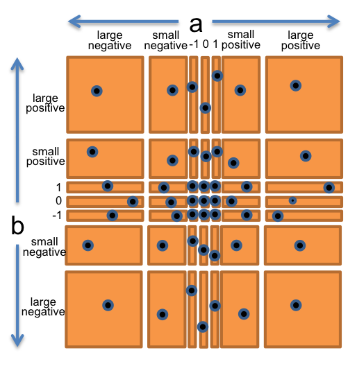
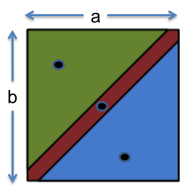

# Testing

## Validation

Testing is an example of a more general process called *validation* . The purpose of validation is to uncover problems in a program and thereby increase your confidence in the program’s correctness. Validation includes:

- **Formal reasoning** (verification): constructs a formal proof that a program is correct.
- **Code review** Having someone else read your code and debug
- **Testing** Running the program on carefully selected inputs and checking results

*Residual defect rates* are bugs leftover after bug has shipped (One kloc is 1000 lines of code)

- 1-10 defects/kloc: typical industry software
- 0.1-1 defects/kloc: high quality validation
- 0.01-0.1 defects/kloc: very best validation - NASA code

**Why testing is hard**

- **Exhaustive testing** is infeasible - the sapce of possible test cases is too big to cover. Imagine exhaustively testing a 32-bit floating-point multiply operation, a*b . There are 2^64 test cases!

- **Haphazard testing** arbitrarily chosen inputs - doesnt work

- **Random/Statistical testing** Unlike physical products where the behaviour is continuous, or failures are distributed probabilistically near the failure point, software behaviour varies discretely across the space of inputs. Failures often happen abruptly.

## Test First Programming

Test early and often: write tests *before* you even write any code!

1. Write specification for function
2. Write tests that exercise that specification
3. Write actual code

The *specification* describes input and output behaviour of the function. Contains types of parameters and additional constraints.

## Choosing test cases by Partitioning

We want to pick a set of test cases that is small enough to run quickly, yet large enough to validate the program. We do this by dividing the input space into **subdomains** - partition the input space into sets of similar inputs on which the program has similar behavior. Then use one representative of each subdomain.

**Example: `BigInteger.multiply()`**

```java
/**
 * @param val another BigIntger
 * @return a BigInteger whose value is (this * val).
 */
public BigInteger multiply(BigInteger val)
```
`multiply` multiplies two `BigInteger`. Used like
```java
BigInteger a = ...;
BigInteger b = ...;
BigInteger ab = a.multiply(b);
```
We can think of `multiply` as taking a function of two inputs each of type `BigInteger` and returning one output of type `BigInteger`. So we have a 2D input space, and we may partition it like:
- `a>0,b>0`
- `a<0,b<0`
- `a>0,b<0`
- `a<0,b>0`

We should also check edge cases like `0`,`1`, and `-1`, extremely small and extremely large values more than `Long.MAX_VALUE`.

Hence, we choose `a` and `b` independently from
- `0`
- `1`
- `-1`
- small positive integer
- small negative integer
- large positive integer
- large negative integer



We thus have 7x7 subdomains and can arbitrarily choose a representative from each subdomain (each section of the grid)

**Example: `max()`**

```java
/**
 * @param a  an argument
 * @param b  another argument
 * @return the larger of a and b.
 */
public static int max(int a, int b)
```
We may partition the input as
- `a<b`
- `a=b`
- `a>b`



### Boundaries in Partition

Bugs often occur at the *boundaries* between subdomains, like:

- 0 is a boundary between positive numbers and negative numbers
- the maximum and minimum values of numeric types, like int and double
- emptiness (the empty string, empty list, empty array) for collection types
- the first and last element of a collection

Boundaries are edge cases that are places of discontinuity (like head and tail of linked list).

For the `max` function, we may instead consider the below partitioning:

- relationship between a and b
  - a < b
  - a = b
  - a > b
- value of a
  - a = 0
  - a < 0
  - a > 0
  - a = minimum integer
  - a = maximum integer
- value of b
  - b = 0
  - b < 0
  - b > 0
  - b = minimum integer
  - b = maximum integer

### Covering the Partition

After partitioning the input space, we can choose how exhaustive we want the test suite to be:

- **Full Cartesian Product** - Every possible subdomain is covered by one test case, like in `multiply` we had 7x7=49 test cases. For `max`, this would be 3x5x5=75 test cases. Note that in practice some of these combinations may not be feasible
- **Cover Each Part** - If every subdomain is covered by at least one test case, but not neccessarily one test case is one combination. We can vastly reduce our test suite, like in `max` we can choose the following 5 test cases to cover all subdomains:
  - (1, 2) covers a < b, a > 0, b > 0
  - (-1, -3) covers a > b, a < 0, b < 0
  - (0, 0) covers a = b, a = 0, b = 0
  - (Integer.MIN_VALUE, Integer.MAX_VALUE) covers a < b, a = minint, b = maxint
  - (Integer.MAX_VALUE, Integer.MIN_VALUE) covers a > b, a = maxint, b = minint

## Blackbox and Whitebox Testing

**Blackbox testing** means choosing test cases only from the specification, without knowing the implementation

**Whitebox testing** means choosing test cases with the knowledge of implementation - writing test cases knowing the exact vulnerabilities

When doing whitebox testing, and a specification requirement is general, make sure dont write tests that are particular to your implementation and not general.

## Documenting Test Strategy

```java
/**
 * Reverses the end of a string.
 *
 * For example:
 *   reverseEnd("Hello, world", 5)
 *   returns "Hellodlrow ,"
 *
 * With start == 0, reverses the entire text.
 * With start == text.length(), reverses nothing.
 *
 * @param text    non-null String that will have
 *                its end reversed
 * @param start   the index at which the
 *                remainder of the input is
 *                reversed, requires 0 <=
 *                start <= text.length()
 * @return input text with the substring from
 *               start to the end of the string
 *               reversed
 */
static String reverseEnd(String text, int start)
```
Document strategy at top of test class
```java
/*
 * Testing strategy
 *
 * Partition the inputs as follows:
 * text.length(): 0, 1, > 1
 * start:         0, 1, 1 < start < text.length(),
 *                text.length() - 1, text.length()
 * text.length()-start: 0, 1, even > 1, odd > 1
 *
 * Include even- and odd-length reversals because
 * only odd has a middle element that doesn't move.
 *
 * Exhaustive Cartesian coverage of partitions.
 */
```
Document each test case decision
```java
// covers test.length() = 0,
//        start = 0 = text.length(),
//        text.length()-start = 0
@Test public void testEmpty() {
    assertEquals("", reverseEnd("", 0));
}
```

## Coverage

How well a test suite covers all the paths a program can take
- **Statement Coverage** every line of code run at least once by test suite
- **Branch Coverage** in each `while` and `if` blocks, are both directions executed at least once?
- **Path Coverage** is every possible path through the program covered?

Path Coverage>Branch Coverage>Statement Coverage. In industry, statement and branch coverage is a common goal. In practice, statement coverage is usually measured by a code coverage tool, which indicates which statements executes by counting the number of times each statement is executed by test suite. With such a tool, white box testing is easy;just measure the coverage of your black box tests, and add more test cases until all important statements are executed.

## Unit Testing and Stubs

A test that tests an individual module, in isolation if possible, is called a **unit test**. The opposite of a unit test is an **integration test** , which tests a combination of modules, or even the entire program.

Example: we have `getWebPage()` that downloads web pages, `extractWords()` that splits page content into words, and `makeIndex` that maps words to pages.

```java
/** @return the contents of the web page downloaded from url 
 */
public static String getWebPage(URL url) {...}

/** @return the words in string s, in the order they appear, 
 *          where a word is a contiguous sequence of 
 *          non-whitespace and non-punctuation characters 
 */
public static List<String> extractWords(String s) { ... }

/** @return an index mapping a word to the set of URLs 
 *          containing that word, for all webpages in the input set 
 */
public static Map<String, Set<URL>> makeIndex(Set<URL> urls) { 
    ...
    for (URL url : urls) {
        String page = getWebPage(url);
        List<String> words = extractWords(page);
        ...
    }
    ...
}
```

- We should think about unit tests in isolation. `extractWords()` unit tests should take in dummy string content instead of using `getWebPage()` to create web content
  - If we use `getWebPage()`, the `extractWords()` unit test may fail due to `getWebPage()` not `extractWords()`, which defeats the point of the unit test!
- However, higher level modules like `makeIndex` would require *stubs* which are mock objects of web content and URLs etc

## Automated Testing and Regression Testing

**Automated Testing** means running tests and checking which tests pass/failed automatically. Still need to manually provide test cases, but systematically checks them.

**Regression Testing** means rerunning tests after every modification. This prevents program from *regressing* introducing new bugs when fixing current bugs and adding features. Whenever fixing a bug, take the input that elicited the bug and add it to test suite. This prevents reversions that reintroduces the bug.

*Test first debugging* means when a bug arises, immediately add it to test suite. Regression testing is only practically if test suite can be run often/easily (automatically). These are combined into **automated regression testing** which is a best-practice.

## Testing Notes

- always put your proper files in a subdirectory called `src`, this is where `junit` will look for test files and associated modules
- in the test files, use assertion print statements instead of `println` because this doesnt work with VSCode's test runner

```java
assertFalse("False Message", file.method(arg1,arg2));
```


