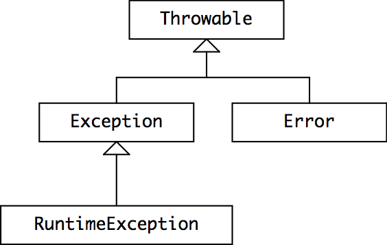

# Exceptions

A method’s *signature* — its name, parameter types, return type — is a core part of its specification, and the signature may also include exceptions that the method may trigger.

## Exceptions for signaling bugs

- `ArrayIndexOutOfBoundsException` thrown when `foo[i]` is outside valid range for `foo`
- `NullPointerException` thrown when trying to call a method on a `null` object reference
- `ArithmeticException` thrown for arithmetic errors like integer division by zero
- `NumberFormatException` when cannot be parsed into an integer

## Exceptions for special results

If code produces special (unwanted) results, instead of returning special values like the date `9/9/99`, we should instead throw an exception like:
```java
BirthdayBook birthdays = ...
try {
    LocalDate birthdate = birthdays.lookup("Alyssa");
    // we know Alyssa's birthday
} catch (NotFoundException nfe) {
    // her birthday was not in the birthday book
}
```

## Catch or Specify Requirement

Code that might cause certain exceptions *must* be enclosed by either of the following:

- A `try` statement that catches the exception. The `try` must provide a handler for the exception
- A method that specifies that it can throw the exception. The method must provide a `throws` clause that lists the exception

Code that fails to honor the Catch or Specify Requirement will not compile.

### 3 kinds of Exceptions

**Checked exception** are exceptional conditions that a well-written applications should anticipate and deal with. These are subject to the Catch or Specify requirement.

**Error exceptions** are exceptional conditions external to application, that the application cannot recover from. These are not subject to the Catch or Specify requirement, as these external errors are indicated by `Error`.

**Runtime exceptions** are exceptional conditions internal to application, that the application usually cannot anticipate or recover from. These are not subject to Catch or Specify, and are indicated by `RuntimeException`.

Note that error and runtime exceptions are termed unchecked exceptions.

```java
// Note: This class will not compile yet.
import java.io.*;
import java.util.List;
import java.util.ArrayList;

public class ListOfNumbers {

    private List<Integer> list;
    private static final int SIZE = 10;

    public ListOfNumbers () {
        list = new ArrayList<Integer>(SIZE);
        for (int i = 0; i < SIZE; i++) {
            list.add(new Integer(i));
        }
    }

    public void writeList() {
	// The FileWriter constructor throws IOException, which must be caught.
        PrintWriter out = new PrintWriter(new FileWriter("OutFile.txt"));

        for (int i = 0; i < SIZE; i++) {
            // The get(int) method throws IndexOutOfBoundsException, which must be caught.
            out.println("Value at: " + i + " = " + list.get(i));
        }
        out.close();
    }
}
```
The constructor initializes an output stream on a file. If the file cannot be opened, the constructor throws an `IOException`. The call to the `ArrayList` class's `get` method, which throws an `IndexOutOfBoundsException` if the value of its argument is too small or too large. If you try to *compile* the `ListOfNumbers` class, the compiler prints an error message about the exception thrown by the `FileWriter` constructor. However, it does not display an error message about the exception thrown by `get`. The reason is that the exception thrown by the constructor, `IOException`, is a checked exception, and the one thrown by the get method, IndexOutOfBoundsException, is an unchecked exception - no catch or specify requirement.

This code doesn't compile because we haven't handled a checked exception `IOException`. To make it compile, we can either:
  - Handle the potential `IOException` with a `try-catch` block
  - Handle it by declaring the method might throw an `IOException`, essentially passing the responsibility up the call stack

```java
    public void writeList() throws IOException {
        // The FileWriter constructor throws IOException, which must be caught.
        PrintWriter out = new PrintWriter(new FileWriter("OutFile.txt"));
        ...
    }
```

As a general rule, you’ll want to use checked exceptions to signal *special results* and unchecked exceptions to signal *bugs*. So if you call `BirthdayBook` ’s `lookup` method and forget to handle the `Not­Found­Exception` , the compiler will reject your code. This is a checked exception handled with try-catch-finally. This ensures that exceptions that are expected to occur will be handled. However for an unchecked exceptions, the compiler will not check for `try - catch` or a `throws` declaration.

### Try-Catch-Finally blocks

```java
try {
    code
}
catch and finally blocks . . .
```

```java
public void writeList() {
    PrintWriter out = null;

    try {
        System.out.println("Entering" + " try statement");

        out = new PrintWriter(new FileWriter("OutFile.txt"));
        for (int i = 0; i < SIZE; i++) {
            out.println("Value at: " + i + " = " + list.get(i));
        }
    } catch (IndexOutOfBoundsException e) {
        System.err.println("Caught IndexOutOfBoundsException: "
                           +  e.getMessage());
                                 
    } catch (IOException e) {
        System.err.println("Caught IOException: " +  e.getMessage());
                                 
    } finally {
        if (out != null) {
            System.out.println("Closing PrintWriter");
            out.close();
        } 
        else {
            System.out.println("PrintWriter not open");
        }
    }
}
```

The `try` block should contain the code where it might possibly raise an exception. The `catch` blocks must take in an object of `ExceptionType` inheriting from a specific class, referring to it with a name like `e`. Note a single `catch` block can also handle multiple exceptions like `catch (IOException|SQLException ex)`. The `finally` block *always* executes when the `try` block exits, usualy containing cleanup code.

### Throw statement

```java
//removes top elem from stack and return the elem
public Object pop() {
    Object obj;

    if (size == 0) {
        //if stack is empty, we instantiate a new ExmptyStackException object and throw it
        throw new EmptyStackException();
    }

    obj = objectAt(size - 1);
    setObjectAt(size - 1, null);
    size--;
    return obj;
}
```
Note that the declaration of the `pop` method does not contain a `throws` clause. `EmptyStackExceptio`n is not a checked exception, so `pop` is not required to state that it might occur.

## Throwable Hierarchy

To understand how Java decides whether an exception is checked or unchecked, let’s look at the class hierarchy for Java exceptions.



`Throwable` is the class of objects that can be thrown or caught. `Error` is a subclass of `Throwable` that is reserved for errors produced by the Java runtime system, such as `StackOverflow­Error` and `OutOfMemory­Error`. Errors should be considered unrecoverable, and are generally not caught.

- `RuntimeException` , `Error` , and their subclasses are unchecked exceptions. The compiler doesn’t require them to be declared in the `throws` clause of a method that throws them, and doesn’t require them to be caught or declared by a caller of such a method.
- All other throwables — `Throwable` , `Exception` , and all of their subclasses *except* for those of the `RuntimeException` and `Error` lineage — are checked exceptions. The compiler requires these exceptions to be caught or declared when it’s possible for them to be thrown.

When you define your own exceptions, you should either subclass `RuntimeException` (to make it an unchecked exception) or `Exception` (to make it checked). Programmers generally don’t subclass `Error` or `Throwable` , because these are reserved by Java itself.

## Design Considerations

You should use an unchecked exception only to signal an unexpected failure (i.e. a bug), or if you expect that clients will usually use code that ensures the exception will not happen; because there is a convenient and inexpensive way to avoid the exception. Otherwise you should use a checked exception.

- `Queue.pop()` throws an *unchecked* `Empty­Queue­Exception` when the queue is empty, because it’s reasonable to expect the caller to avoid this with a call like `Queue.size()` or `Queue.isEmpty()`
- `int integerSquareRoot(int x)` throws a *checked* `Not­Perfect­Square­Exception` when x has no integral square root, because testing whether x is a perfect square is just as hard as finding the actual square root, so it’s not reasonable to expect the caller to prevent it

A generic exception is
```java
throw new Exception("A general error occurred");
```

However, exceptions in Java are designed for use only under exceptional circumstances. On a typical machine, the exception-based logic runs 70 times slower than the standard one when looping from 0 to 99. Be careful when using these!


