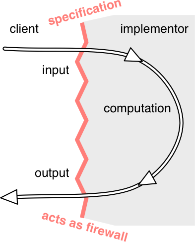

# Specifications

Specifications define the expected behaviour of components, serving as a contract between stakeholders and developers.



The contract acts as a firewall between client and implementor. It shields the client from the details of the workings of the unit — you don’t need to read the source code of the procedure if you have its specification. And it shields the implementor from the details of the usage of the unit; he doesn’t have to ask every client how she plans to use the unit. This firewall results in decoupling , allowing the code to be changed independently, so long as the changes respect the specification — each obeying its obligation.

## Behavioural Equivalence

```java
static int findFirst(int[] arr, int val) {
    for (int i = 0; i < arr.length; i++) {
        if (arr[i] == val) return i;
    }
    return arr.length;
}

static int findLast(int[] arr, int val) {
    for (int i = arr.length -1 ; i >= 0; i--) {
        if (arr[i] == val) return i;
    }
    return -1;
}
```

Both methods seek to find a `val` in `arr`, but have different behaviour:
- when `val` is missing, `findFirst` returns the length of `arr` and `findLast` returns `-1`;
- when `val` appears twice, `findFirst` returns the lower index and `findLast` returns the higher.

However when `val` appears exactly once, both methods return that index and behave the same. Depending on the specifications, it may that the client will only ever pass in `arr` with just one element `val`. For such cases, both methods are the same, and are behaviourally equivalent. This is subjective. Our specification may be:

```
static int find(int[] arr, int val)
  requires: val occurs exactly once in arr
  effects:  returns index i such that arr[i] = val
```

## Specification Structure

A specification contains:
- a *precondition*, indicated by the keyword *requires*, obligation of the client
- a *postcondition*, indicated by the keyword *effects*, obligation of the implementer

*If* the precondition holds, *then* the postcondition *must* hold. If the precondition does not hold, *then* the implementation is not bound by the postcondition. Its free to do anything like not terminating or throwing an exception etc.

A specification of a method can talk about the parameters and return value of the method, but it should never talk about local variables of the method or private fields of the method’s class. You should consider the implementation invisible to the reader of the spec.

### Specifications in Java

Java has a convention for documentation comments , in which parameters are described by `@param` clauses and results are described by `@return` and `@throws` clauses. You should put the preconditions into `@param` where possible, and postconditions into `@return` and `@throws` . So the above finding value specification would be written like 

```java
/**
 * Find a value in an array.
 * @param arr array to search, requires that val occurs exactly once
 *            in arr
 * @param val value to search for
 * @return index i such that arr[i] = val
 */
static int find(int[] arr, int val)
```

## Null references

In hava, a reference can point to the special value `null` (except primitives).
```java
String name = null;
int[] points = null;
double depth = null; // illegal, primtives cannot point to null
```

Arrays of non-primitives and collections can also contain `null` as a value:
```java
String[] names = new String[] { null };
List<Double> sizes = new ArrayList<>();
sizes.add(null);
```

`null` is not the same as an empty string or empty array, these still can call methods and access fields.

Null values are trouble and unsafe, we **do not reccomend** using them. In most good Java, null values are implicitly disallowed in parameters and return values - every precondition parameters and and return values must be non-null in general. `null` is ambigious - it's rarely obvious what a `null` return value means or how we arrive there.

## Testing and Specifications

Even glass box tests must follow specifications. They should be general enough to fit the entire specification. With this specification,
```java
static int find(int[] arr, int val)
  requires: val occurs in arr
  effects:  returns index i such that arr[i] = val
  ```

```java
int[] array = new int[] { 7, 7, 7 };
assertEquals(0, find(array, 7));  // bad test case: violates the spec; too specific!
assertEquals(7, array[find_correct(array, 7)]);  // correct
```

## Specifications for Mutations

Mutation to inputs is *disallowed* unless stated otherwise . In the absence of a postcondition describing mutation, we demand no mutation of the inputs.

