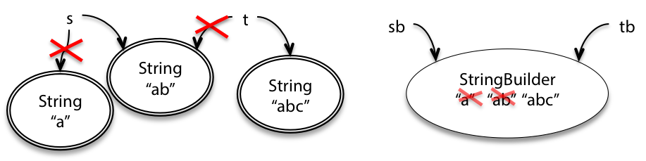
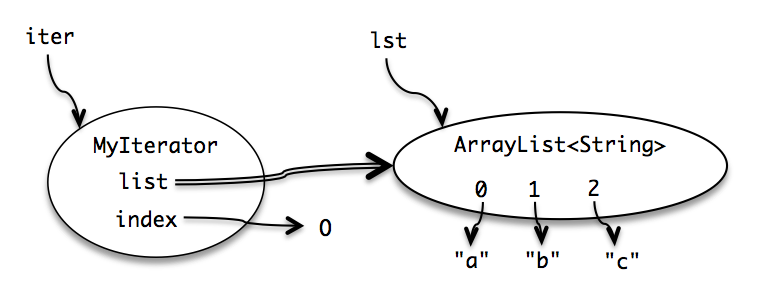

# Mutability and Immutability

## Mutability

Some objects are immutable - once created, the object cannot be modified. Mutable objects have methods that can modify the object.



`String` is a immutable type:
```java
String s = "a";
s = s.concat("b"); // s+="b" and s=s+"b" also mean the same thing
String t = s;
t = t + "c";
```

Compared with `StringBuilder` which is mutable:
```java
StringBuilder sb = new StringBuilder("a");
sb.append("b");
StringBuilder tb = sb;
tb.append("c");
```

We need the mutable `StringBuilder` so we can concatenate a large number of strings together easily. Suppose we had to do `n` modifications; using `String` will copy the object many unneccessary times while `StringBuilder` allows us to reduce copying and have better performance.

## Risks of Mutation

However, immutable types are safer from bugs, easier to understand, and more ready for change. Mutability makes code harder to understand, and more difficult to enforce contracts

### Risk 1: Passing Mutable Values

If have `method1` that directly modifies the object, and `method2` that expects the original unmodified object, this will cause problems. Example,

```java
// meanwhile, somewhere else in the code...
public static void main(String[] args) {
    // ...
    List<Integer> myData = Arrays.asList(-5, -3, -2);
    ///modifies myData where each element becomes its absolute value
    System.out.println(sumAbsolute(myData));
    //we expect -10, but will get the wrong value of 10 here!
    System.out.println(sum(myData));
}
```

When reading `main()`, it is unclear whether `sum()` or `sumAbsolute()` actually modifies `myData` too.

### Risk 2: Returning Mutable Values

Suppose we define a class variable `names` and another method `addName()` that directly adds a new name to this class variable `names`. Suppose we also have `getNames()` that should return a copy, but it instead directly returns the mutable class variable. If we do `addName("a")` then `currentNames = getNames()` and do `currentNames.add("b")`, we have modified the class variable to be `[a,b]` when it should really be `[a]`. See `MutableReturnExample.java` for details.

One solution here is to simply return a **copy** of the answer where appropriate. This pattern is called **defensive copying** which we use for mutable types. However, this creates a new copy every single time we call the function. Another solution is to use an immutable type, which involves less copying and less memory.

### Aliasing is the root cause

Multiple references to the same object is called aliasing, and is the root cause of our problems here. `sumAbsolute()`'s developer thinks it's okay to modify `myData`, but `main()`'s developer actually wants `myData` to be unmodified.

## Specification for Mutating Methods

Specification indicating mutation:
```java
static void sort(List<String> lst)
  requires: nothing
  effects:  puts lst in sorted order, i.e. lst[i] <= lst[j]
              for all 0 <= i < j < lst.size()
```
Without mutation:
```java
static void sort(List<String> lst)
  requires: nothing
  effects:  returns a new list in sorted order, i.e. lst[i] <= lst[j]
              for all 0 <= i < j < lst.size()
```
If the effects do not explicitly say that an input can be mutated, then assume mutation of the input is implicitly disallowed. Surprise mutations lead to terrible bugs.

## Iteration

An *iterator* steps through a collection of elements and is implicitly used in for loops. An iterator has 2 methods:
- `next()` returns the next element in the collection
- `hasNext()` checks if iterator has reached the end of the collection

Note that the `next()` method is a mutator method that changes the internal state of the iterator.

### `MyIterator`

We implement an example iterator for `ArrayList <String>`

```java
/**
 * A MyIterator is a mutable object that iterates over
 * the elements of an ArrayList<String>, from first to last.
 * This is just an example to show how an iterator works.
 * In practice, you should use the ArrayList's own iterator
 * object, returned by its iterator() method.
 */
public class MyIterator {
    //these are instance variables

    //the final here incdicates list instance variable must refer to the same object
    private final ArrayList<String> list; //this list here is a constructor
    private int index;
    // list[index] is the next element that will be returned
    // by next()
    // index == list.size() means no more elements to return

    /**
     * Make an iterator.
     * 
     * @param list list to iterate over
     */
    public MyIterator(ArrayList<String> list) {
        // `this.list` and `this.index` are instance objects
        this.list = list;
        this.index = 0;
    }

    /**
     * Test whether the iterator has more elements to return.
     * 
     * @return true if next() will return another element,
     *         false if all elements have been returned
     */
    public boolean hasNext() {
        return index < list.size();
    }

    /**
     * Get the next element of the list.
     * Requires: hasNext() returns true.
     * Modifies: this iterator to advance it to the element
     * following the returned element.
     * 
     * @return next element of the list
     */
    public String next() {
        final String element = list.get(index);
        ++index;
        return element;
    }
}
```



The double arrow indicates the `MyIterator.list` instance variable has a fixed reference.

Iterators are an effective design pattern that allow us to step through different kinds of collections with different internal representations.

### Mutation Undermines an Iterator

When we modify a list while we're iterating over a list, this causes bugs.
- When we remove a specific element from the list, the indices of all subsequent elemenets shift, hence if we use the same style of indexing, we'll skip elements.
> I've faced this bug commonly before, be careful of this!

## Mutation and Contracts

Mutable objects used with aliasing means multiple parts of the program modify the same shared state, potentially violating assumptions and causing unexpected and difficult-to-find bugs.

Using immutable objects (like `String` instead of `char[]`) prevents such problems, making the code safer and easier to reason about.

## Useful Immutable Types

- Primitive types and their wrappers
- Don’t use mutable `Date` types, use the appropriate immutable type from `java.time`
- The usual implementations of Java’s collections types — `List , Set , Map` — are all mutable: `ArrayList` , `HashMap` , etc. Collections has methods for obtaining unmodifiable views of these mutable collections:

  - `Collections.unmodifiableList`
  - `Collections.unmodifiableSet`
  - `Collections.unmodifiableMap`

This is an unmodifiable *view* of the collection object (note that modifying the underlying collection object will have a different view!) A client who has a reference to the wrapper and tries to perform mutations — add , remove , put , etc. — will trigger an `Unsupported­Operation­Exception` .

Be careful not refer to the mutable collection, lest we accidentally mutate it. (One way to do that is to let it go out of scope.) Accidentally mutating the underlying object defeats the whole point of these view objects.
