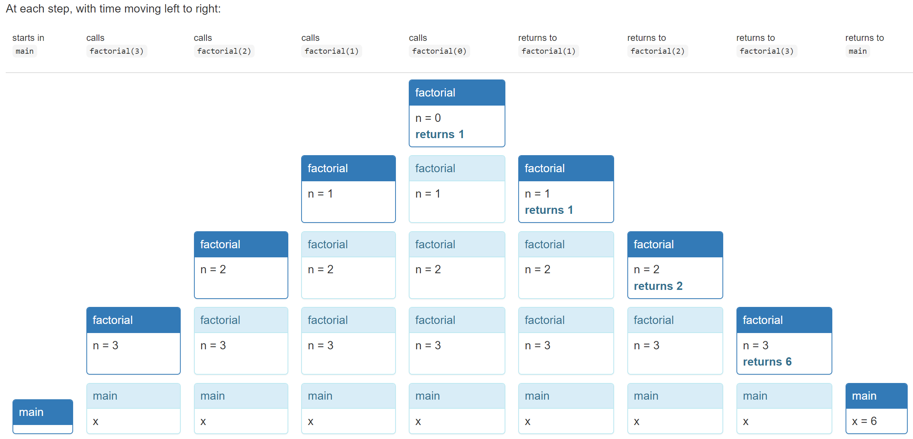

# Recursion

To visualize the execution of a recursive function, it's helpful to diagram the call stack of current-executing functions. Here's the call stack for `factorial(3)`



## 0/1 knapsack

```java
/**
 * @param word consisting only of letters A-Z or a-z
 * @return all subsequences of word, separated by commas,
 * where a subsequence is a string of letters found in word 
 * in the same order that they appear in word.
 */
public static String subsequences(String word) {
    if (word.isEmpty()) {
        return ""; // base case
    } else {
        //get the first charac
        char firstLetter = word.charAt(0);
        //get the rest of word without first charac
        String restOfWord = word.substring(1);

        //recursive step
        String subsequencesOfRest = subsequences(restOfWord);

        String result = "";
        for (String subsequence : subsequencesOfRest.split(",", -1)) {
            //add all subsequences without this first word; all existing subsquences
            result += "," + subsequence;
            //add first word to all of these subsequences
            result += "," + firstLetter + subsequence;
        }
        result = result.substring(1); // remove extra leading comma
        return result;
    }
}
```

## Structure of Recursive Implementations

- **base case** , which is the simplest, smallest instance of the problem, that can’t be decomposed any further. Base cases often correspond to emptiness – the empty string, the empty list, the empty set, the empty tree, zero, etc.

- **recursive step** , which decomposes a larger instance of the problem into one or more simpler or smaller instances that can be solved by recursive calls, and then recombines the results of those subproblems to produce the solution to the original problem.

A recursive function may have more than one base case, and also more than one recursive step.

## Helper Methods

We can use *direct* recursive implementation, where given only a word we return all its possible subsequences. We can also use a **helper function**, which has a slightly different specification from our main function, often also taking a variable storing the current state at this recurisve call.

For example, given the original word "orange", we can create a function that takes a partial subsequence "oran" and the remaining "ge". This returns all possible subsequence of "ge" concatenated with our partial; hence this call will return "oran"+"g", "oran"+"e", "oran".

```java
/**
 * Return all subsequences of word (as defined above) separated by commas,
 * with partialSubsequence prepended to each one.
 */
private static String subsequencesAfter(String partialSubsequence, String word) {
    if (word.isEmpty()) {
        // base case
        return partialSubsequence;
    } else {
        // recursive step
        //dont include the current charac
        return subsequencesAfter(partialSubsequence, word.substring(1))
             + ","
             //include the current charac
             + subsequencesAfter(partialSubsequence + word.charAt(0), word.substring(1));
    }
}
//the initial call from the main function
public static String subsequences(String word) {
    return subsequencesAfter("", word);
}
```

This helper method makes our code much simpler. This helper function `subsequencesAfter` satisifies a different specification from `subsequences`, as it requires a new parameter `partialSubsequence`. This parameter stores the temporary state during the evolution of the computation.

**Don't expose the helper method to your clients** Use a private helper function, and have your public method call it.

## Reentrant Code

Reentrant code can be safely re-entered - it can bve called again *even while another call to it is underway*. We do this by keeping its state completely in parameters in local variables, no class (static) variables or global variables, and doesn't share aliases to mutable objects with other parts of the porgrams or other calls to itself.

Direct recursion is what we've seen so far; `factorial(n-1)` can be called even though `factorial(n)` is still working. Mutual recursion means `A` calls `B`, which then calls `A` again. It's good to design reentrant code wherever possible.

## When to use Recursion VS Iteration

We use recursion when:
- The problem is naturally recursive (Fibonacci)
- The data is naturally recursive (File systems)

We use recursion to take advantage of immutability. In ideal recursive implementation:
- all variables are final
- all data is immutable
- methods are pure functions - they do not mutate anything
  - Behaviour of methods are simply a relationship between its parameters and return value, with no side effects on any other part of the program
  - This is called *functional programming*, in contrast to *imperative programming* with loops and variables
  - Iterative implementations have non-final variables or mutable objects, modified throughout iteration.

However, recursive methods may take more space than iterative methods, as building up a stack of recursive calls consumes extra memory.
