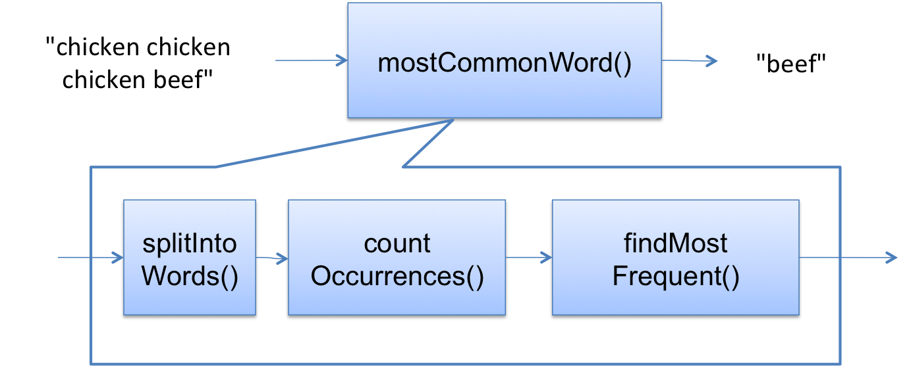

# Debugging

## Reproduce the Bug

Start by finding a small and repeatable test case that produces the failure. If the bug was found by regression testing, you've already found the exact conditions that's reproduced the bug! After you've found a new bug and new test conditions, make sure to add it into your regression test suite so the bug never crops up again.

## Understand the Location and Cause of the Bug

```java
/**
 * Find the most common word in a string.
 * @param text string containing zero or more words, 
 *     where a word is a string of alphanumeric 
 *     characters bounded by nonalphanumerics.
 * @return a word that occurs maximally often in text, 
 *         ignoring alphabetic case.
 */
public static String mostCommonWord(String text) {
    ... words = splitIntoWords(text); ...
    ... frequencies = countOccurrences(words); ...
    ... winner = findMostCommon(frequencies); ...
    ... return winner;
}

/** Split a string into words ... */
private static List<String> splitIntoWords(String text) {
    ...
}

/** Count how many times each word appears ... */
private static Map<String,Integer> countOccurrences(List<String> words) {
    ...
}

/** Find the word with the highest frequency count ... */
private static String findMostCommon(Map<String,Integer> frequencies) {
    ...
}
```

1. **Study the Data**
- Read the stack traces
- Localize the bug
  - Perhaps you have two related test cases that *bracket* the bug where one fails and the other succeeds: maybe `mostCommonWord("c c, b")` is broken but `mostCommonWords(c c b)` is fine

2. **Hypothesize**
- Hypothesize which point of the process flow where the bug occurs



If an exception is raised in `countOccurrences()`, then the bug cannot be downstream like in `findMostFrequent()`. It may be in `splitIntoWords()` or `countOccurrences()`

3. **Experiment**

- Run a *different test case* to reproduce the bug
- Insert a *print statement* or *assertion*
- Set a breakpoint using a debugger, to look at variable and object values

First probe to make sure you know **exactly** why the bug occurs, instead of trying to fix it quickly ASAP.

## Other tips

**Swap Components** If you think the bug exists in `binarySearch()`, then replace it with a default `lienarSearch()` and see if that fixes the issues. If it does, then the bug must exist in `binarySearch()`. You can waste a lot of time swapping unfailing components, however, so don’t do this unless you have good reason to suspect a component.

## Fix the Bug

Before slapping on a fix, think about:
- if the bug is a design error, do I need to redesign the system?
- Is the bug repeated elsewhere in the code?

Add bug test case to regression suite, and run the tests to make sure the bug is fixed.