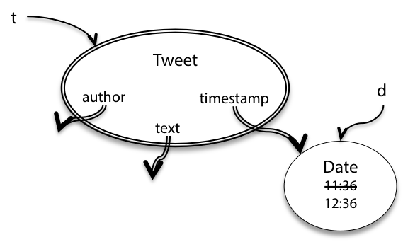
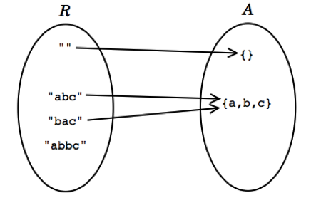

# Abstraction Functions and Rep Invariants

The abstraction function will give us a way to cleanly define the equality operation on an abstract data type. The rep invariant will make it easier to catch bugs caused by a corrupted data structure.

## Invariants

The final and possibly most important property of ADTs is that it *preserves its own invariants*. An invariant is a property of a program that is always true, for every possible runtime state of the program. (Immutability is one crucial invariant). An ADT preserves its own invariants, if the ADT is responsible for ensuring its own invariants hold, and doesn't depend on behaviour from clients.

### Immutabiity

The first threat from immutability comes from the fact that can clients can (must) directly access fields, potentially modifying internal fields directly. This is **representation exposure**. Then, we can't change the implementation without affecting all the clients who are directly accessing those fields.

```java
/**
 * This immutable data type represents a tweet from Twitter.
 */
public class Tweet {

    public String author;
    public String text;
    public Date timestamp;

    /**
     * Make a Tweet.
     * @param author    Twitter user who wrote the tweet
     * @param text      text of the tweet
     * @param timestamp date/time when the tweet was sent
     */
    public Tweet(String author, String text, Date timestamp) {
        this.author = author;
        this.text = text;
        this.timestamp = timestamp;
    }
}
```

#### Representation Exposure due to Inappropriate Access

Clients can directly access instance variables:

```java
Tweet t = new Tweet("justinbieber", 
                    "Thanks to all those beliebers out there inspiring me every day", 
                    new Date());
t.author = "rbmllr";
```

We then use `private` and `public` keywords to restrict access from outside the class:

```java
public class Tweet {

    private final String author;
    private final String text;
    private final Date timestamp;

    public Tweet(String author, String text, Date timestamp) {
        this.author = author;
        this.text = text;
        this.timestamp = timestamp;
    }

    /** @return Twitter user who wrote the tweet */
    public String getAuthor() {
        return author;
    }

    /** @return text of the tweet */
    public String getText() {
        return text;
    }

    /** @return date/time when the tweet was sent */
    public Date getTimestamp() {
        return timestamp;
    }

}
```
The `final` keyword also helps us gurantee fields of this immutable type won't be reassigned after construction.

#### Representation Exposure due to Aliasing

However, we have not solved rep exposure completely! Consider:
```java
/** @return a tweet that retweets t, one hour later*/
public static Tweet retweetLater(Tweet t) {
    Date d = t.getTimestamp();
    d.setHours(d.getHours()+1);
    return new Tweet("rbmllr", t.getText(), d);
}
```


The `getTimestamp` call returns a *reference* to the *same* `Date` object referenced by tweet `t` . `t.timestamp` and `d` are aliases to the *same mutable object*. So when that date object is mutated by `d.setHours()` , this affects the date in `t` as well, as shown in the snapshot diagram.

Tweet ’s immutability invariant has been broken. The problem is that Tweet leaked out a reference to a mutable object that its immutability depended on. We exposed the rep, in such a way that Tweet can no longer guarantee that its objects are immutable.

We solve this by using defensive copying: making a copy of a mutable object to avoid leaking out the reference to the internal rep:

```java
public Date getTimestamp() {
    return new Date(timestamp.getTime());
}
```

Another alternative to copy a mutable object is the `clone()` method.

You should carefully inspect the argument types and return types of all your ADT operations. If any of the types are mutable, make sure your implementation doesn’t return direct references to its representation. Doing that creates rep exposure.

An even better solution to copying mutable types is to use immutable types. If we had used `java.time.ZonedDateTime` instead of the mutable `java.util.Date` then we would have avoided the problem of rep exposure. Or, we could just use immutable wrappers around mutable types like `Collections.unmodifiableList()`.

## Rep Invariant and Abstraction Function

Representation values R are what are actually stored by the program (e.g. some bytes that describe a floating-point value). The space of representation values contains all of the possible such values. Abstract values A are what we are trying to represent, like the float `0.3`.

Suppose we choose to use a string to represent a set of characters:



Then the rep space R contains strings and the abstract space A is the mathematical set of characters.

- Every abstract value is mapped to by some rep value 
  - We must be able to represent every abstract value
- Some abstract values are mapped to multiple rep values
  - There are multiple valid reps of on abstract value
- Not all rep values are mapped
  - The string "abbc" is not mapped as we have decided that the string should not contain duplicates

An *abstraction function* maps rep values to the abstract values they represent `AF: R -> A`

A *rep invariant* maps rep values to booleans `RI R -> boolean`. For a rep value $r$, $RI(r)$ is ture if and only if $r$ is mapped by $AF$. $RI$ basically tells us if this $r$ is a valid rep value.

```java
public class CharSet {
    private String s;
    // Rep invariant:
    //    s contains no repeated characters
    // Abstraction Function:
    //   represents the set of characters found in s
    ...
}
```

### No Null Values in the Rep

null values are troublesome and unsafe. The preconditions and postconditions of our methods implicitly require objects and arrays be non-null. The rep invariant should also include `x!=null` for every rep value `x`.

```java
class CharSet {
    String s;
}
```
then the rep invariant automatically includes `s!=null`. If we want to implement the `checkRep()` method, we should still implement the `s!=null` check.

## Documenting the AF, RI, and Safety from Rep Exposure

Representation exposure threatens both representation independence and invariant preservation. Hence we write a rep exposure safety argument, which examines each part of the rep and explains why this doesn't expose the rep.


Here’s an example of `Tweet` from PS1 with its rep invariant, abstraction function, and safety from rep exposure fully documented:
```java
// Immutable type representing a tweet.
public class Tweet {

    private final String author;
    private final String text;
    private final Date timestamp;

    // Rep invariant:
    //   author is a Twitter username (a nonempty string of letters, digits, underscores)
    //   text.length <= 140
    // Abstraction Function:
    //   represents a tweet posted by author, with content text, at time timestamp 
    // Safety from rep exposure:
    //   All fields are private;
    //   author and text are Strings, so are guaranteed immutable;
    //   timestamp is a mutable Date, so Tweet() constructor and getTimestamp() 
    //        make defensive copies to avoid sharing the rep's Date object with clients.

    // Operations (specs and method bodies omitted to save space)
    public Tweet(String author, String text, Date timestamp) { ... }
    public String getAuthor() { ... }
    public String getText() { ... }
    public Date getTimestamp() { ... }
}
```

### How to Ensure Rep Invariance

The invariant about an object is a property that holds throughout the entire lifetime of the object.

To make an invariant hold, we need to:

- make the invariant true in the initial state of the object; 
- and ensure that all changes to the object keep the invariant true.

Translating this in terms of the types of ADT operations, this means:

- creators and producers must establish the invariant for new object instances; and
- mutators and observers must preserve the invariant.

The risk of rep exposure makes the situation more complicated. If the rep is exposed, then the object might be changed anywhere in the program, not just in the ADT’s operations, and we can’t guarantee that the invariant still holds after those arbitrary changes. So the full rule for proving invariants is:

If an invariant of an abstract data type is

- established by creators and producers;
- preserved by mutators and observers;
- no representation exposure occurs,

then the invariant is true of all instances of the abstract data type.

## ADTs replace preconditions

Many of the places where we place preconditions on arguments, we could've used a custom ADT instead:

```java
/** 
 * @param set1 is a sorted set of characters with no repeats
 * @param set2 is likewise
 * @return characters that appear in one set but not the other,
 *  in sorted order with no repeats 
 */
static String exclusiveOr(String set1, String set2);
```

can be used with ADTs:

```java
/** @return characters that appear in one set but not the other */
static SortedSet<Character> exclusiveOr(SortedSet<Character>  set1, SortedSet<Character> set2);
```

which makes the code safer from bugs and the preconditions only need to be enforced in the `SortedSet` type.