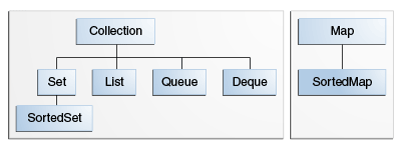

# Core Collection Interfaces

The core collection interfaces encapsulate different types of collections, which allow collections to be manipulated indepedently of representation details.



Note that all core collection interfaces are generic like `public interface Collection<E>...`. However, when you declare a collection you can and *should* specify the type of object contained within. This reduces compile-time errors.

## The Collection Interface

The `Collection` interface is used to pass around collections of objects where maximum generality is desired.

**Key Methods**

- `boolean add(E e)` adds the element `e` and returns `true` if collection is changed
- `boolean remove(Object o)` removes `o` and returns `true` if collection changed

- `int size()` returns the number of elements in this collection
- `boolean isEmpty()` returns true if collection has no elements
- `boolean contains(Object o)` returns `true` if collection contains the element
  - more formally returns `true` if and only if collection has at least one element `e` where `(o==null ? e==null : o.equals(e))`

- `Iterator<E> iterator()` returns an iterator over the elements in this collection
- `Object[] toArray()` returns an array containing all of the elements in this collection
  - note that `Arrays` are not part of `Collection`

**Bulk Operations**
- `boolean addAll(Collection<? extends E> c)` adds all the elements of the collection `c` to this current collection. returns `true` if this collection changed
- `boolean removeAll(Collection<?> c)` removes all of the collection `c`'s elements from this collection. returns `true` if this collection changed
- `boolean retainAll(Collection<?> c)` retains only the elements in this collection that are also contained in `c`. returns `true` if this collection changed
- `boolean containsAll(Collection<?> c)` returns `true` if this collection contains all the elements of `c`
- `void clear()` removes all elements from this collection

**Traversal Methods**

1. Obtaining a **stream** and perform aggregate operations on it
```java
myShapesCollection.stream()
.filter(e -> e.getColor() == Color.RED)
.forEach(e -> System.out.println(e.getName()));
```
2. **`for-each`** construct

```java
for (Object o : collection)
    System.out.println(o);
```
3. **Iterators**

An `Iterator` alllows you to traverse the collection and remove elements selectively if desired. The interface is:
```java
public interface Iterator<E> {
    //returns true if more elements left
    boolean hasNext();
    //returns next element in iteration
    E next();
    //remove last element
    void remove(); //optional
}
```

The `remove` method removes the last element that was returned by `next` from the underlying `Collection`. The `remove` method may be called only once per call to `next` and throws an exception if this rule is violated.

> Note that `Iterator.remove` is the *only* safe way to modify a collection during iteration

Use an `Iterator` instead of `for-each` when you need to
- remove the current element
- iterate over multiple collections in parallel

The following method traverses the collection while removing specific elements:
```java
static void filter(Collection<?> c) {
    for (Iterator<?> it = c.iterator(); it.hasNext(); )
        if (!cond(it.next()))
            it.remove();
}
```