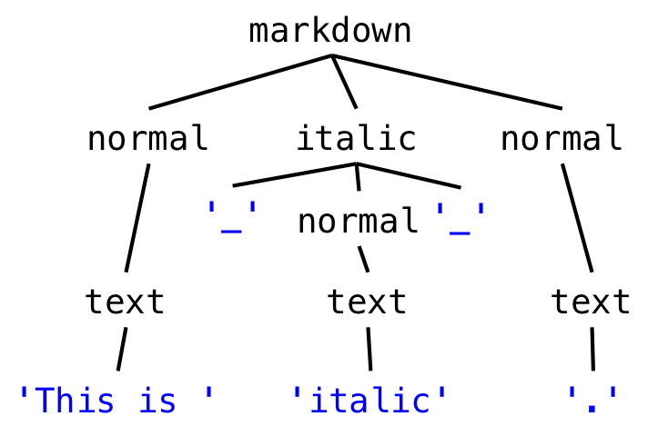
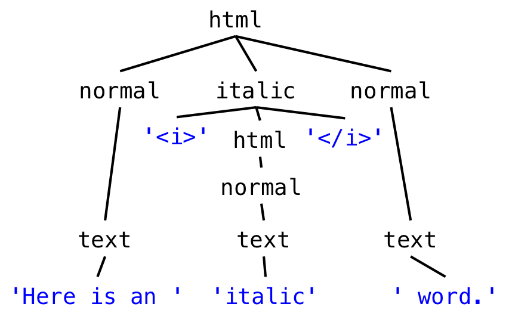

# Grammars

## Introduction

Some program modules take input/produce output in the form of a sequence of bytes or a sequence of characters, which is called a string when it’s simply stored in memory, or a stream when it flows into or out of a module. Concretely, a sequence of bytes or characters might be:

- A file on disk, in which case the specification is called the *file format*
- Messages sent over a network, in which case the specification is a *wire protocol*
- A command typed by the user on the console, in which case the specification is a *command line interface*
- A string stored in memory

For these sequences, we introduce the notion of a grammar , which distinguishes between legal and illegal sequences, but also to parse a sequence into a data structure that a program can work with. The data structure produced from a grammar will often be a recursive data type.

We also talk about a specialized form of a grammar called a regular expression. In addition to being used for specification and parsing, regular expressions are a widely-used tool for many string-processing tasks.

## Grammars

- a *grammar* defines a set of valid *sentences*, where each sentence is a sequence of characters.
  - Our grammer for URLs will specificy the set of valid URLs, where each sentence is a URL
- The actual characters (symbols) in a sentence are called *terminals* (tokens)
  - These are like leaves of a tree, indivisible elemnents, like `"."` ,`"/"`,`"a"` or `"https"`
- Each *production* determines a *non-terminal*, where each non-terminal is made up of terminals and other non-terminals. Non-terminal are basically non-lead nodes. 

A single production has the below form:
```
nonterminal ::= expression of terminals, nonterminals, and operators
```

One of the nonterminals is designated at the root - the set of sentences that matches the root nonterminal are those defined by the grammar. This is normally called `root` or `start`, or in the context of URLs it is called the `url`.

### Grammar Operators

The three most important operators in a production expression are:

- concatenation
```js
x ::= y z     an x is a y followed by a z
```

- repetition
```js
x ::= y*      an x is zero or more y
```

- union (also called alternation)
```js
x ::= y | z     an x is a y or a z
```

Additional operators made of these three:

- option (0 or 1 occurrence)
```js
x ::=  y?      an x is a y or is the empty sentence
```

- 1+ repetition (1 or more occurrences)
```js
x ::= y+       an x is one or more y
               (equivalent to  x ::= y y* )
```
- character classes
```js
x ::= [abc]  is equivalent to  x ::= 'a' | 'b' | 'c' , the or operator
x ::= [^b]   is equivalent to  x ::= 'a' | 'c' | 'd' | 'e' | 'f' 
                                         | ... (all other characters), the nor operator
```

By convention, the operators `*` , `?` , and `+` have highest precedence, which means they are applied first. Alternation `|` has lowest precedence, which means it is applied last. Parentheses can be used to override this precedence, so that a sequence or alternation can be repeated:

- grouping using parentheses
```js
x ::=  (y z | a b)*   an x is zero or more y-z or a-b pairs
```

### Example: URL

#### Simple URL

```js
url ::= 'http://' hostname '/'
hostname ::= word '.' word
word ::= [a-z]+
```
this grammar will match patterns like `http://stanford.edu/` or `http://google.com/`. The *parse tree* is


The leaves (terminals) are in blue, while the nonterminals are in black. Note that there are 3 expressions hence 3 nonterminals.

We can also express this grammar using a single nonterminal - hence called *regular expression*
```js
url ::= 'http://' [a-z]+ '.' [a-z]+  '/'
```

### Recursive URLs

If we want to include an optional port number like `http://didit.csail.mit.edu:4949/`, we do:

```js
url ::= 'http://' hostname (':' port)? '/' 
hostname ::= word '.' hostname | word '.' word
port ::= [0-9]+
word ::= [a-z]+
```

The hostname is now recursive defined it terms of itself! If we wanted to use iteration instead, we could've also wrote the hostname like:
```js
hostname ::= (word '.')+ word
```

### Example: Markdown and HTML

Suppose we want to know the grammars for italic texts in both markdown and HTML.

**Markdown**
```
This is an _italic_ word.
```

and the corresponding grammar is like:
```js
markdown ::=  ( normal | italic ) *
italic ::= '_' normal '_'
normal ::= text
text ::= [^_]*
```


**HTML**
```
Here is an <i>italic</i> word.
```
with the corresponding grammar of
```js
html ::=  ( normal | italic ) *
italic ::= '<i>' html '</i>'
normal ::= text
text ::= [^<>]*
```


## Regular Expressions

### Regular Grammar

A *regular* grammar has a special property: a grammar defined by a singel production. By substituting every nonterminal (except the root) with its right-hand side, then we've reduced it down to a single production for the root, with only terminals and operators on the right hand side.

Example with the URL with port number:
```js
url ::= 'http://' ([a-z]+ '.')+ [a-z]+ (':' [0-9]+)? '/' 
```

Markdown:
```js
markdown ::= ([^_]* | '_' [^_]* '_' )*
```

However HTML is like:
```js
html ::=  ( [^<>]* | '<i>' html '</i>' ) *
```
Since we have the recursive use of HTMLs on the right hand side, this grammar is not regular. So regexes can be expressed without recursion!

### Regular Expression

A regular grammar can be further reduced to a regular expression. A regular expression (called *regex* for short) does away with the quotes around the terminals, and the spaces between terminals and operators, so that it consists just of terminal characters, parentheses for grouping, and operator characters.

For example, the regular expression for our markdown format is just
```js
([^_]*|_[^_]*_)*
```

Common operators in regex include
```
.       any single character

\d      any digit, same as [0-9]
\s      any whitespace character, including space, tab, newline
\w      any word character, including letters and digits

\., \(, \), \*, \+, ...
        escapes an operator or special character so that it matches literally
```
Using backslashes `\` is important - sometime terminal characters are used as operators like `.`. Hence we do `\.` to represent the terminal `"."`.

### Regex in Java

We use regex for manipulating strings like `String.split` , `String.matches` , `java.util.regex.Pattern`.

Replace all spaces with a single space:
```java
String singleSpacedString = string.replaceAll(" +", " ");
```

Match a URL:
```java
Pattern regex = Pattern.compile("http://([a-z]+\\.)+[a-z]+(:[0-9]+)?/");
Matcher m = regex.matcher(string);
if (m.matches()) {
    // then string is a url
}
```

Extract part of a HTML tag:
```java
Pattern regex = Pattern.compile("<a href=['\"]([^']*)['\"]>");
Matcher m = regex.matcher(string);
if (m.matches()) {
    String url = m.group(1); 
    // Matcher.group(n) returns the nth parenthesized part of the regex
}
```
Notice the backslashes in the URL and HTML tag examples. In the URL example, we want to match a literal period `.` , so we have to first escape it as `\.` to protect it from being interpreted as the regex match-any-character operator, and then we have to further escape it as `\\.` to protect the backslash from being interpreted as a Java string escape character. In the HTML example, we have to escape the quote mark `"` as `\"` to keep it from ending the string.