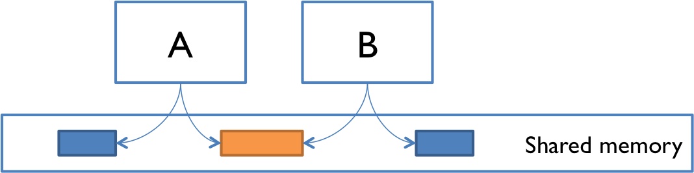
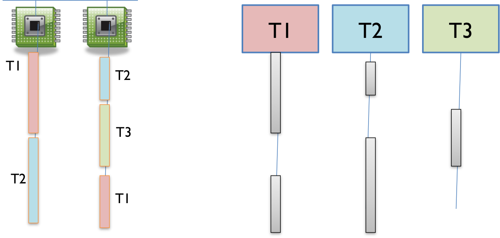
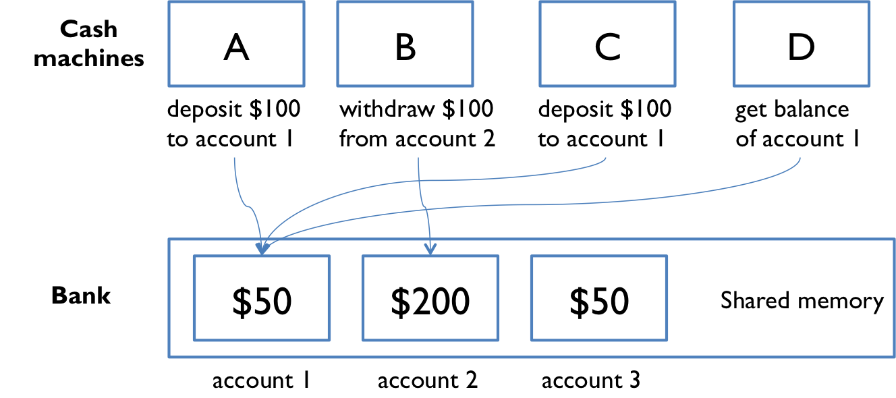
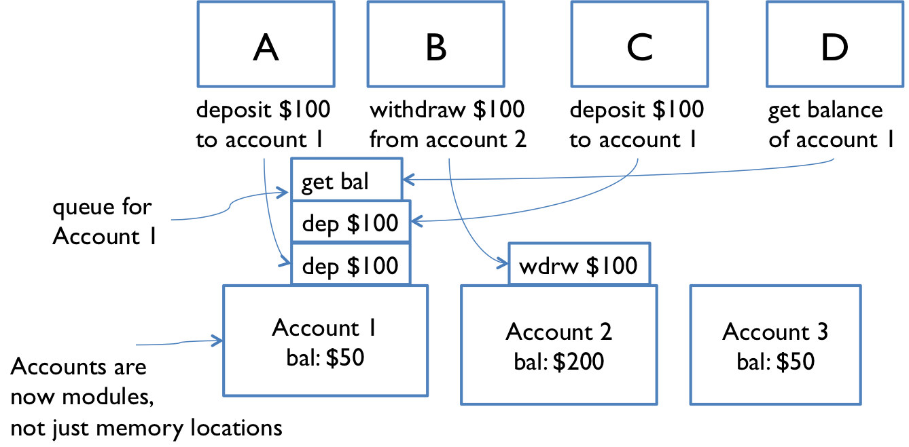

# Concurrency

Concurrency means multiple computations are happening at the same time. Examples:
- Multiple computers in a network
- Multiple applications running on one computer
- Multiple processors in a computer (today, often multiple processor cores on a single chip)

## Two Models for Concurrent Programming

**Shared memory** - concurrent modules interact by reading and writing shared objects in memory.



Examples:

- A and B might be two processors (or processor cores) in the same computer, sharing the same physical memory.
- A and B might be two programs running on the same computer, sharing a common filesystem with files they can read and write.
- A and B might be two threads in the same Java program (we’ll explain what a thread is below), sharing the same Java objects.

**Message passing** - concurrent modules interact by sending messages to each other through a communication channel. Modules send off messages, and incoming messages to each module are queued up for handling.


Examples:

- A and B might be two computers in a network, communicating by network connections.
- A and B might be a web browser and a web server – A opens a connection to B and asks for a web page, and B sends the web page data back to A.
- A and B might be an instant messaging client and server.
- A and B might be two programs running on the same computer whose input and output have been connected by a pipe

## Processes, Threads, Time-slicing

Message-passing and shared-memory models are about how concurrent modules communicate. Concurrent modules themselves come in two forms: processes and threads.

**Process**
- A running program *isolated* from other process on the same machine, with private section of machine's memory
- Share no memory with other processes; each process independent
- Basically a virtual computer, has a self-contained execution environment
- Most JVMs run as a single process (multiprocess usage is beyond this scope)
- Instantly ready for message-passing, input & output streams are `System.out` and `System.in` in Java

**Thread**
- If a process represents a virtual computer, threads represent a virtual processor - a lightweight processor within another processor!
- share same memory as other threads in the process
- Instantly ready for shared-memory, as all threads share the same memory of this process
  - Need to sewtup message-passing explicitly using queues
- Multithreading is essential in Java, you start with the main thread and create additional threads

**Time-slicing**

When there are more threads than processors, concurrency is simulated via **time-slicing** where one processor switches between threads:



The first processor is originally running thread T1, then switches to T2.

### Defining and Starting Threads

We provide a `Runnable` object.  The `Runnable` interface defines a single method, `run`, meant to contain the code executed in the thread. The `Runnable` object is passed to the `Thread` constructor. We then call `start` on the thread:

```java
public class HelloRunnable implements Runnable {
    public void run() {
        System.out.println("Hello from a thread!");
    }
    public static void main(String args[]) {
        (new Thread(new HelloRunnable())).start();
    }
}
```

> An alternative is to subclass `Thread` by extending it and starting it immediately. Do not ever do this!

### Anonymous classes

We use anonymous class to create our `Runnable` objects sometimes. Anonymous classes allow you to declare and instantiate a class in one step, without naming it. Used for quick one-off implementations of interfaces.

Instead of
```java
public class Greeter implements Runnable {
    public void run() {
        System.out.println("Hello!");
    }
}

// Usage
new Thread(new Greeter()).start();
```

we can do

```java
new Thread(new Runnable() {
    public void run() {
        System.out.println("Hello!");
    }
}).start();
```


## Shared Memory Example

Suppose we have multiple ATMs A and B executing transactions, where one transaction consists of a deposit and withdrawal. They all share the same `balance`.



```java
// suppose all the cash machines share a single bank account
private static int balance = 0;

private static void deposit() {
    balance = balance + 1;
}
private static void withdraw() {
    balance = balance - 1;
}
```
```java
// each ATM does a bunch of transactions that
// modify balance, but leave it unchanged afterward
private static void cashMachine() {
    for (int i = 0; i < TRANSACTIONS_PER_MACHINE; ++i) {
        //a single transaction consists of a deposit and withdrawal
        deposit(); // put a dollar in
        withdraw(); // take it back out
    }
}
```

Each transaction should leave the `balance` unchanged. However if we have multiple ATMs executing transactions at the same time, `balance` may not be zero at the end of the day.

### Interleaving

Suppose we have 2 ATMs, A and B, working on a deposit at the same time. A deposit at low level is:

```
get balance (balance=0)
add 1
write back the result (balance=1)
```

Suppose we interleave these operations like:
|A|B|
|-|-|
|A get balance (balance=0)||
|A add 1||
|A write back the result (balance=1)||
||B get balance (balance=1)|
||B add 1|
||B write back the result (balance=2)|

This causes no problems. But now suppose we interleave like this:

|A|B|
|-|-|
|A get balance (balance=0)||
||B get balance (balance=0)|
|A add 1||
||B add 1|
|A write back the result (balance=1)||
||B write back the result (balance=1)|

The balance is now 1 – A’s dollar was lost! A and B both read the balance at the same time, computed separate final balances, and then raced to store back the new balance – which failed to take the other’s deposit into account.

### Race Condition

The above illustrates a **race condition**. A race condition means that the correctness of the program (the satisfaction of postconditions/invariants) depends on the relative timing of events in concurrent computations A and B. When this happens, we say “A is in a race with B.”.

Some interleaving is OK, but some will produce wrong answers, violating postconditions and rep invariants.

### Tweaking the code Doesn't Help
```java
// version 1
private static void deposit()  { balance = balance + 1; }
private static void withdraw() { balance = balance - 1; }

// version 2
private static void deposit()  { balance += 1; }
private static void withdraw() { balance -= 1; }

// version 3
private static void deposit()  { ++balance; }
private static void withdraw() { --balance; }
```

All three versions have the interleaving problem - they're too high level. We can't easily tell by looking expressions whether it will be safe from race conditions!

### Reordering

Even worse, the actual execution order of instructions can differ from the order they appear in the code, due to optimizations may by compilers, processors, or memory systems.

## Message Passing Example

Instead of shared memory, we now have separate modules cash machines (A, B, C, D) and accounts (1, 2, 3).



- Both accounts and ATMs are modules now, where each account is its own modules
- Execution of operations by accounts are done by done in order by processing messages in a queue
- ATMs send messages to account modules, messages are queued and process, and responses are sent back to ATMs as messages

Race conditions can still occur with interleaving, but this time the *messages* are interleaved instead of *instructions* executed by the ATMs A and B. 

Suppose A and B only will withdraw if balance is sufficient; `if balance >= 1 then withdraw 1`. Consider this sequence:

```
a. A sends "get-balance" message
b. B sends "get-balance" message
c. Account responds to A: balance is $1
d. Account responds to B: balance is $1
e. A sends "withdraw $1" message
f. B sends "withdraw $1" message
```
Then, both A and B end up withdrawing and the account dips below 0 - overdraft!

## Concurrency is Hard to Test and Debug

Hard to discover race conditions during testing, and even harder to localize the bug. This is because concurrency bugs exhibit very poor reproducibility: the interleaving depends on relative timing of events strongly affected by environment like network traffic, variations in processsor clock etc.

Print statements are also horrible to use! Printing is often 100-1000x slower than regular operations, so they dramatically alter the timing of operations and the same concurrent bugs may not appear.


