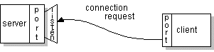
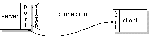

# Sockets

`URL`s and `URLConnection`s provide a relatively high-level mechanism for accessing resources on the Internet. Sometimes your programs require lower-level network communication, for example, when you want to write a client-server application.

TCP provides a reliable, point-to-point communication channel for client-server communications. To communicate over TCP, a client program and a server program establish a connection to one another. Each program binds a socket to its end of the connection. To communicate, the client and the server each reads from and writes to the socket bound to the connection.

## What is a socket?

> A socket is one endpoint of a two-way communication link between client-server. A socket is bound to a port number so that the TCP layer can identify the application that data is destined to be sent to.
>
> An endpoint is a combination of an IP address and a port number. Every TCP connection can be uniquely identified by its two endpoints. That way you can have multiple connections between your host and the server.

Normally, a server runs on a specific computer and has a socket that is bound to a specific port number. The server just waits, listening to the socket for a client to make a connection request.

The client knows the hostname of the machine on which the server is running, and the port number on which the server is listening. To make a connection request, the client tries to connect with the server on the server's machine and port. The client also needs to identify itself to the server so it binds to a local port number on the server that it will use during this connection.



If everything goes well, the server accepts the connection. Upon acceptance, the server gets a *new* socket bound to the same local port and also has its remote endpoint set to the address and port of the client. It needs a new socket so that it can continue to listen to the original socket for connection requests while tending to the needs of the connected client.



On the client side, if the connection is accepted, a socket is successfully created and the client can use the socket to communicate with the server.

The client and server can now communicate by writing to or reading from their sockets.

## Reading and Writing to a Socket

The client sends data to and receives data from the server via the `Socket` class.

The example program implements a client, `EchoClient`, that connects to an echo server. The echo server receives data from its client and echoes it back.

The `EchoClient` example creates a socket, thereby getting a connection to the echo server. It reads input from the user on the standard input stream, and then forwards that text to the echo server by writing the text to the socket. The server echoes the input back through the socket to the client. The client program reads and displays the data passed back to it from the server.

Writing to socket's output will send data to server, while reading from socket's input will view data coming in from server.

```java
import java.io.*;
import java.net.*;
 
public class EchoClient {
    public static void main(String[] args) throws IOException {
         
        if (args.length != 2) {
            System.err.println(
                "Usage: java EchoClient <host name> <port number>");
            System.exit(1);
        }
        // args is the command line args, first is a string containing server hostname
        String hostName = args[0];
        //second arg is the port number
        int portNumber = Integer.parseInt(args[1]);
 
        try (
            //create a socket that connects to the server
            Socket echoSocket = new Socket(hostName, portNumber);
            //gets the socket's output stream and opens a PrintWriter on it named out
            PrintWriter out =
                new PrintWriter(echoSocket.getOutputStream(), true);
            // gets the socket's input stream and opens a BufferedReader on it named in.
            BufferedReader in =
                new BufferedReader(
                    new InputStreamReader(echoSocket.getInputStream()));
            // input stream from command line, wrapped with BufferedReader object
            BufferedReader stdIn =
                new BufferedReader(
                    new InputStreamReader(System.in))
        ) {
            String userInput;
            //The while loop continues until the user types an end-of-input character
            //reads a line at a time from the standard input stream
            while ((userInput = stdIn.readLine()) != null) {
                //sends the line to the server by writing it to the PrintWriter connected to the socket
                out.println(userInput);
                // reads a line of information from the BufferedReader connected to the socket
                //The readLine method waits until the server echoes the information back to EchoClient (due to the nature of buffer) When readline returns, EchoClient prints the information to the standard output.
                System.out.println("echo: " + in.readLine());
            }
        } catch (UnknownHostException e) {
            System.err.println("Don't know about host " + hostName);
            System.exit(1);
        } catch (IOException e) {
            System.err.println("Couldn't get I/O for the connection to " +
                hostName);
            System.exit(1);
        } 
    }
}
```

> the Java runtime automatically closes the readers and writers connected to the socket and to the standard input stream, and the socket connection to the server.
> 
> The Java runtime closes these resources in reverse order that they were created. (This is good because streams connected to a socket should be closed before the socket itself is closed.)

This client program is straightforward and simple because the echo server implements a simple protocol. The client sends text to the server, and the server echoes it back. However, the basics will always be:

1. Open a socket.
2. Open an input stream and output stream to the socket.
3. Read from and write to the stream according to the server's protocol.
4. Close the streams.
5. Close the socket.

Only step 3 differs from client to client, depending on the server.

## Writing the Server side of a socket

```
Server: "Knock knock!"
Client: "Who's there?"
Server: "Dexter."
Client: "Dexter who?"
Server: "Dexter halls with boughs of holly."
Client: "Groan."
```

The example consists of two independently running Java programs: the client program and the server program. The client program is implemented by a single class, `KnockKnockClient`. The server program is implemented by two classes: `KnockKnockServer` and `KnockKnockProtocol`. `KnockKnockServer` contains the main method for the server program and performs the work of listening to the port, establishing connections, and reading from and writing to the socket. The class `KnockKnockProtocol` serves up the jokes. It keeps track of the current joke, the current state (sent knock knock, sent clue, and so on), and returns the various text pieces of the joke depending on the current state. This object implements the protocol—the language that the client and server have agreed to use to communicate.

We use `ServerSocket` for this.

### Knock Knock Server

```java
import java.net.*;
import java.io.*;

public class KnockKnockServer {
    public static void main(String[] args) throws IOException {
        
        if (args.length != 1) {
            System.err.println("Usage: java KnockKnockServer <port number>");
            System.exit(1);
        }

        int portNumber = Integer.parseInt(args[0]);

        try (
            //choose an unused port
            ServerSocket serverSocket = new ServerSocket(portNumber);
            //The accept method waits until a client starts up and requests a connection on the host and port of this server.
            //When a connection is requested and successfully established, the accept method returns a new Socket object which is bound to the same local port and has its remote address and remote port set to that of the client.
            //this version doesnt support handling more client requests
            Socket clientSocket = serverSocket.accept();
            //Gets the socket's input and output stream and opens readers and writers on them.
            //send data to client
            PrintWriter out =
                new PrintWriter(clientSocket.getOutputStream(), true);
            //read data from client
            BufferedReader in = new BufferedReader(
                new InputStreamReader(clientSocket.getInputStream()));
        ) {
        
            String inputLine, outputLine;
            
            // Initiate conversation with client
            KnockKnockProtocol kkp = new KnockKnockProtocol();
            outputLine = kkp.processInput(null);
            out.println(outputLine);

            //while client sends in data
            while ((inputLine = in.readLine()) != null) {
                //As long as the client and server still have something to say to each other, the server reads from and writes to the socket, sending messages back and forth between the client and the server.
                outputLine = kkp.processInput(inputLine);
                //send out data to client
                out.println(outputLine);
                if (outputLine.equals("Bye."))
                    break;
            }
        } catch (IOException e) {
            System.out.println("Exception caught when trying to listen on port "
                + portNumber + " or listening for a connection");
            System.out.println(e.getMessage());
        }
    }
}
```

### Supporting Multiple Clients

`KnockKnockServer` handle a single connection request. However, multiple client requests can come into the same port and, consequently, into the *same* `ServerSocket`. Client connection requests are queued at the port, so the server must accept the connections sequentially. However, the server can service them simultaneously through the use of threads—one thread per each client connection.

The basic flow of logic in such a server is this:
```
while (true) {
    accept a connection;
    create a thread to deal with the client;
}
```