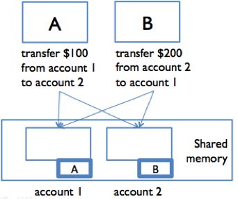

# Locks and Synchronization

*Thread Safety* for data typoe/function is behaving correctly when used from multiple threads, regardless of how threads are executed. (Refer to chapter 20).

Synchronization prevent threads from accessing the shared data at the same time. **Locks** are one synchronization technique. A lock on an object is an abstraction that allows at most one thread to own it at a time.
- `acquire` allows a thread to take ownership of a lock. If a thread tries to acquire a lock currently owned by another thread, it *blocks* until the other thread releases the lock
- `release` relinquishes ownership of the lock, so another thread can take ownership of it

## Deadlocks

Deadlock occurs when concurrent modules are stuck waiting for each other to do something.



Here, both accounts are locked, but this also means a transfer between them cannot happen.

The signal feature of deadlock is a cycle of dependencies , e.g. A is waiting for B which is waiting for C which is waiting for A. None of them can make progress.

## Locks in Java

*Every* object in Java has a lock implicitly, and we used the `synchronized` statement to acquire the lock for the duration of a statement block

```java
//every object can be a lock!
Object lock = new Object();
synchronized (lock) { // thread blocks here until lock is free
    // now this thread has the lock
    balance = balance + 1;
    // exiting the block releases the lock
}
```

Locks guard access to data. However, the lock only prevents other threads from entering synchronized blocks using the same lock; does not prevent accessing the object's fields diretly.

## Monitor Pattern

The most convenient lock is the object instance itself, `this`. We can guard the entire rep of a class by wrapping *all access* to the rep inside `synchronized(this)`.

> In Java, we can add this to the method signature
> `public synchronized void insert(..)` is equivalent

```java
/** SimpleBuffer is a threadsafe EditBuffer with a simple rep. */
public class SimpleBuffer implements EditBuffer {
    private String text;
    ...
    public SimpleBuffer() {
        synchronized (this) {
            text = "";
            checkRep();
        }
    }
    public void insert(int pos, String ins) {
        synchronized (this) {
            text = text.substring(0, pos) + ins + text.substring(pos);
            checkRep();
        }
    }
    ...
    public int length() {
        synchronized (this) {
            return text.length();
        }
    }
}
```
Noet that *every* method must be guarded wiht the lock - both read and write functions> Otherwise, the reads may be able to see the rep in a partially modified state. This is the **monitor** pattern - every method is mutually exclusive, so only one thread can be runnning an instance at a time.

Note that constructors cannot be synchronized, because only the thread that creates an object should have access to it while it is being constructed.

### Locking Discipline

TO ensure thread safety,

1. Every shared mutable variable must be guarded by some lock. The data may not be read or written except inside a synchronized block that acquires that lock.

2. If an invariant involves multiple shared mutable variables (which might even be in different objects), then all the variables involved must be guarded by the same lock. Once a thread acquires the lock, the invariant must be reestablished before releasing the lock.

## Atomic Operations

Consider a find-and-repalce operation:

```java
/** Modifies buf by replacing the first occurrence of s with t.
 *  If s not found in buf, then has no effect.
 *  @returns true if and only if a replacement was made
 */
public static boolean findReplace(EditBuffer buf, String s, String t) {
    int i = buf.toString().indexOf(s);
    if (i == -1) {
        return false;
    }
    buf.delete(i, s.length());
    buf.insert(i, t);
    return true;
}
```

This method is not threadsafe, because although `indexOf`,`delete` etc are atomic, other threads may still mutate `buf` while `findReplace` is working. To prevent this, `findReplace` needs to synchronize with all other clients of `buf`:

```java
public static boolean findReplace(EditBuffer buf, String s, String t) {
    synchronized (buf) {
        int i = buf.toString().indexOf(s);
        if (i == -1) {
            return false;
        }
        buf.delete(i, s.length());
        buf.insert(i, t);
        return true;
    }
}
```
Hence `findReplace` is atomic.

> Don't sprinkle `synchronized` everywhere because it massively slows down stuff

## Deadlocks

This locking approach is powerful, but it introduces blocking. With locking, deadlock happens when threads acquire multiple locks at the same time, and two threads end up blocked while holding locks that they are each waiting for the other to release. The monitor pattern unfortunately makes this fairly easy to do.

```java
//social network class
public class Wizard {
    private final String name;
    private final Set<Wizard> friends;
    // Rep invariant:
    //    name, friends != null
    //    friend links are bidirectional: 
    //        for all f in friends, f.friends contains this
    // Concurrency argument:
    //    threadsafe by monitor pattern: all accesses to rep 
    //    are guarded by this object's lock

    public Wizard(String name) {
        this.name = name;
        this.friends = new HashSet<Wizard>();
    }

    public synchronized boolean isFriendsWith(Wizard that) {
        return this.friends.contains(that);
    }

    public synchronized void friend(Wizard that) {
        if (friends.add(that)) {
            that.friend(this);
        } 
    }

    public synchronized void defriend(Wizard that) {
        if (friends.remove(that)) {
            that.defriend(this);
        } 
    }
}
```

If we run 2 independent threads:

```java
    // thread A                   // thread B
    harry.friend(snape);          snape.friend(harry);
    harry.defriend(snape);        snape.defriend(harry);
```
We will deadlock:
- Thread A acquires the lock on `harry`
- Thread B acquires lock on `snape`
- They both update their indivdual reps, but cannot call `friend` on the other object

### Deadlock Solution 1: Lock Ordering

One way to prevent deadlock is to put an ordering on the locks that need to be acquired simultaneously, and ensuring that all code acquires the locks in that order. We can use an alphabetical order:

```java
public void friend(Wizard that) {
    Wizard first, second;
    if (this.name.compareTo(that.name) < 0) {
        first = this; second = that;
    } else {
        first = that; second = this;
    }
    synchronized (first) {
        synchronized (second) {
            if (friends.add(that)) {
                that.friend(this);
            } 
        }
    }
}
```

Anytime someone calls `friend`, `harry` lock will be acquired first. If thread A gets Harry’s lock before B does, it will also get Snape’s lock before B does, because B can’t proceed until A releases Harry’s lock again. The ordering on the locks forces an ordering on the threads acquiring them, so there’s no way to produce a cycle in the waiting-for graph.

Drawbacks:

- First, it’s not modular — the code has to know about all the locks in the system
- Second, it may be difficult or impossible for the code to know exactly which of those locks it will need before it even acquires the first one

### Deadlock Solution 2: Coarse-grained locking

Just use a single lock to guard many object instances, or even the whole subsystem.

```java
public class Wizard {
    private final Castle castle;
    private final String name;
    private final Set<Wizard> friends;
    ...
    public void friend(Wizard that) {
        synchronized (castle) {
            if (this.friends.add(that)) {
                that.friend(this);
            }
        }
    }
}
```

Comes with significant performance penalty.